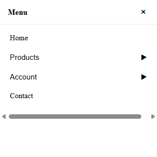
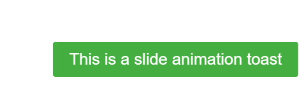

# React + TypeScript + Vite + Storybook

A small component library project built with React, TypeScript, and Vite. It includes a Storybook for interactive component development and documentation.

## Tech stack
- React 19 + TypeScript
- Vite 7
- Storybook 10 (React Vite)
- ESLint

## Getting started
1. Install dependencies:
   ```bash
   npm install
   ```
2. Run the app:
   ```bash
   npm run dev
   ```
   The app will start with Vite.
3. Run Storybook:
   ```bash
   npm run storybook
   ```
   Storybook will start on port 6006 by default.

## Available scripts
- `npm run dev`: Start Vite dev server
- `npm run build`: Type-check and build the app
- `npm run preview`: Preview the production build
- `npm run lint`: Run ESLint
- `npm run storybook`: Start Storybook in dev mode
- `npm run build-storybook`: Build static Storybook

## Components
This repo contains the following components under `src/components` with corresponding stories under `src/stories`:

- `Input`
- `Sidebar`
- `Toast`

Each component has at least two states demonstrated in Storybook. Below are screenshots of key states.

### Input
Stories: `Text`, `TextClearable`, `Password`, `PasswordClearable`, `Number`, `NumberClearable`.

Input — Text (clearable):<br>


Input — Password (clearable):<br>


### Sidebar
Story: `Default` (toggle open/close; nested items; fullscreen layout).

Sidebar — Open:<br>


Sidebar — Opened Submenus:<br>


### Toast
Stories: `FadeDefault`, `FadeWithCloseButton`, `FadeShortDuration`, `FadeLongDuration`, `SlideDefault`, `SlideWithCloseButton`, `SlideShortDuration`, `SlideLongDuration`, `SuccessMessage`, `ErrorMessage`, `NotificationMessage`.

Toast — Fade default:<br>


Toast — Slide default:<br>


Toast — Error message:<br>


## Storybook UI
Storybook itself showing the components.

Storybook — UI:<br>
